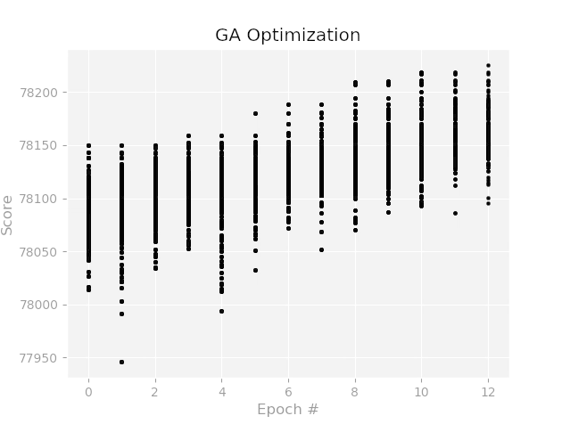

# Optimization of Bridge Repair

## Description
Optimize a repair plan for bridges using genetic algorithms ([GA](https://en.wikipedia.org/wiki/Genetic_algorithm)).

##  In Brief
It is assumed that there are three type of repair for a bridge: (1) light, (2) medium, and (3) heavy. Using the index of each of those repair type, in addition to (0) being "Do Nothing", chromosomes are created for the GA. The objective function uses a scoring system to evaluate each repair plan.

## Data Source
Data is publically available at [FHWA](https://www.fhwa.dot.gov/bridge/nbi/ascii.cfm). [This report](https://www.fhwa.dot.gov/bridge/mtguide.pdf) is also needed to understand the codes used in the NBI.

## How to run
1. Install dependencies: `pip install matplotlib numpy`

2. Run the model in python: `python Model.py`

## Example of the optimization running

